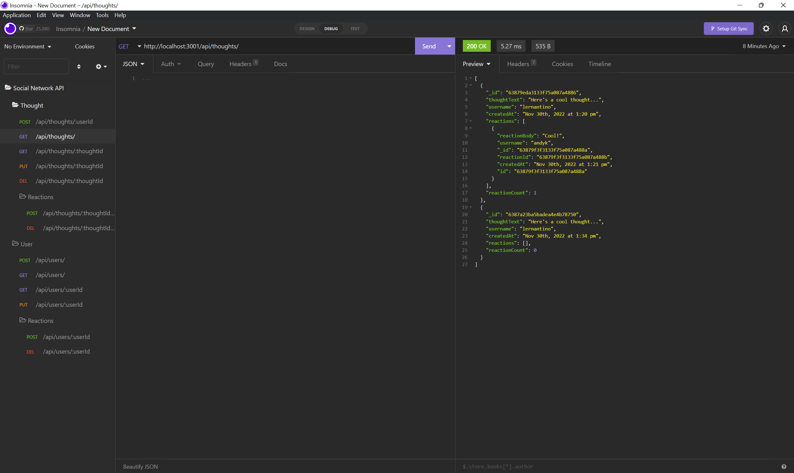

# Social-Network-API

## Description

  This application uses express, mongoose, and nosql to run a social network backend api. This allows the site to pull, display, create and delete information
  to allow users to connect, post comment, and react to each other's day to day lives.

  ## Table of Contents

  - [Installation](#installation)
  - [Usage](#usage)
  - [Contributing](#contributing)
  - [License](#license)
  - [Tests](#tests)
  - [Questions](#questions)

  ## Installation

  To install this project, download the files from my repository at https://github.com/AndrewKamSki/Social-Network-API. From there run an 'npm install' in the console to load in the correct packages, then run a 'npm start' to start the application!

  ## Usage
  A walkthrough video of the app's capabilities! => https://drive.google.com/file/d/1j2vUgOhLnZ9mFWTZqNWoqgppZh_6Dly4/view?usp=sharing

  In insomnia, you can use the GET, POST, PUT, and DELETE routes in the routes folder to receive, add new, update, and delete data

  

  ## Contributing

  No other contributors were on this project

  ## License
  The License being used is: MIT
  If you would like to read more on this please click the badge to navigate to the license page: 
  

  ## Tests

  No tests have been created yet for this project
  
  ## Questions

  If you would like to collaborate or have any questions feel free to contact me on my Github!
    - [My github](https://github.com/AndrewKamSki)